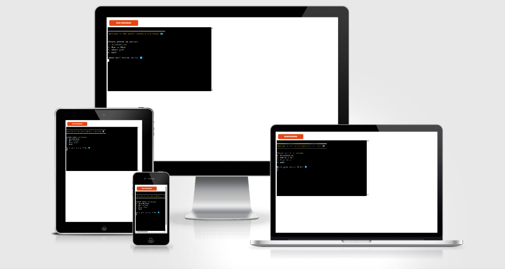
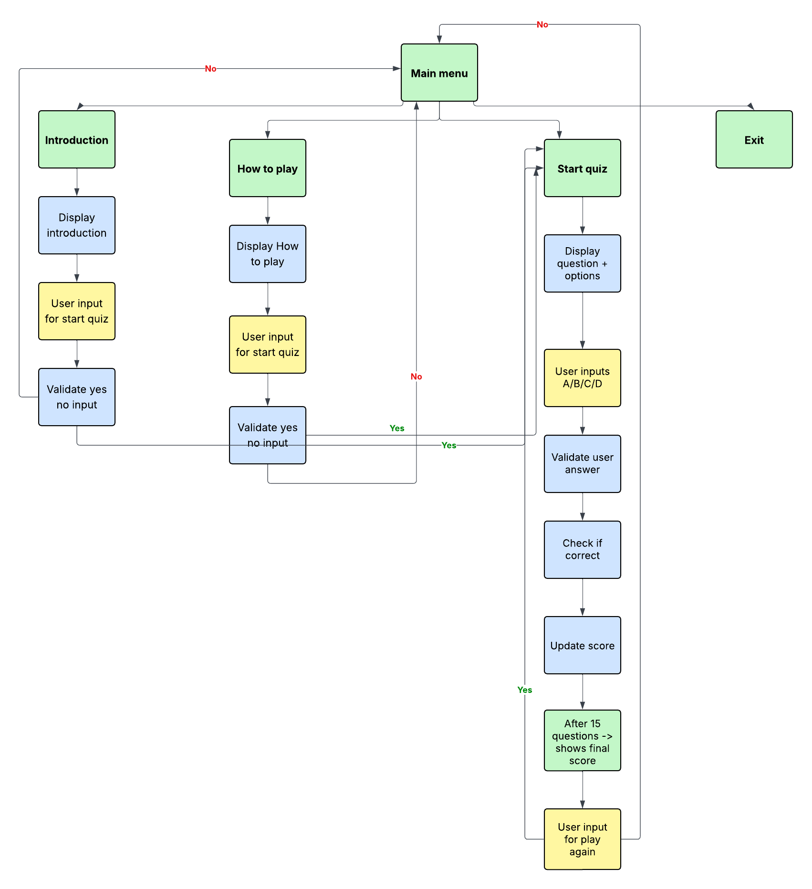
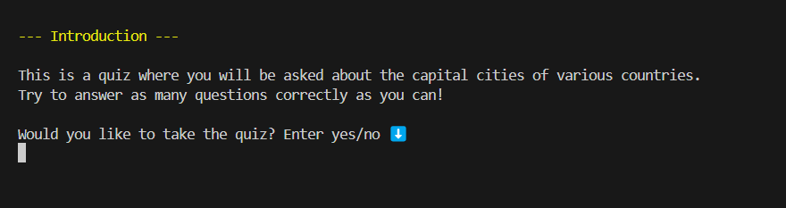
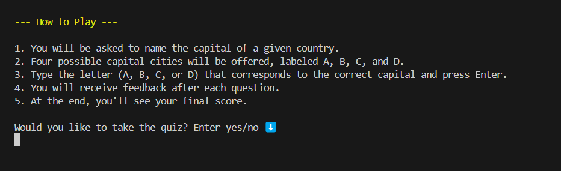
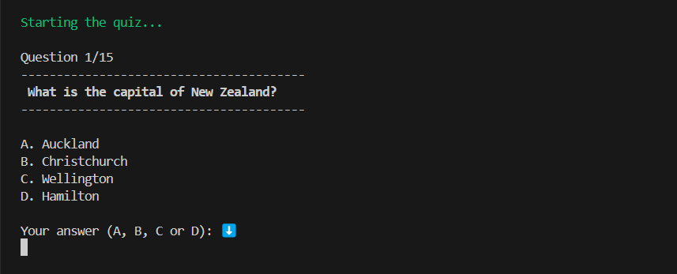
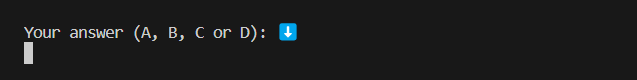
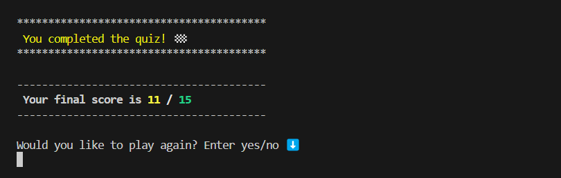
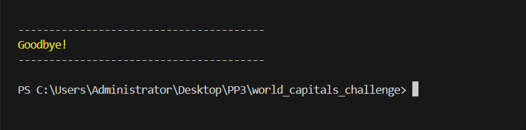
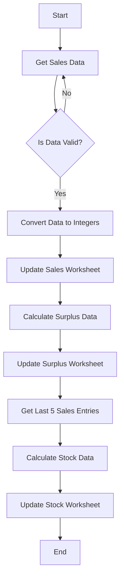

# [world_capitals_challenge](https://world-capitals-challenge-8c5cb27a06c5.herokuapp.com)

Developer: Marija Velichkovska ([marijavelickovska](https://www.github.com/marijavelickovska))

[](https://www.github.com/marijavelickovska/world_capitals_challenge/commits/main)
[](https://www.github.com/marijavelickovska/world_capitals_challenge/commits/main)
[](https://www.github.com/marijavelickovska/world_capitals_challenge)


This is a terminal-based quiz game where players answer questions about the capital cities of countries around the world. The quiz consists of 15 randomly selected questions from a pool of 30, with four answer options for each.
Players interact with the quiz by typing A, B, C, or D in the terminal. Throughout the game, the current question number and score are shown. At the end, a message displays the final score and marks the completion of the quiz.



source: [world_capitals_challenge amiresponsive](https://amiresponsive.blogspot.com/?url=https%3A%2F%2Fworld-capitals-challenge-8c5cb27a06c5.herokuapp.com%2F)

> [!IMPORTANT]
> The examples in these templates are strongly influenced by the Code Institute walkthrough project called "Love Sandwiches".

## UX

### The 5 Planes of UX

#### 1. Strategy

**Purpose**
- To create a simple and engaging quiz game that tests knowledge of world capitals.
- To offer an educational tool that can be used for fun or learning purposes in a terminal environment.

**Primary User Needs**
- A lightweight and intuitive game that runs entirely in the terminal.
- Clear instructions and real-time feedback during gameplay (progress and score).

**Business Goals**
- Offer a reusable codebase that could be adapted for other educational topics or quizzes.
- Increase visibility as a developer through a well-structured open-source project.

#### 2. Scope

**[Features](#features)** (see below)

**Content Requirements**
- Main menu (introduction, how to play, start quiz, exit)
- 15 random questions selected from a pool of 30
- Each question includes four possible answers (A–D)
- Quiz progress indicator (e.g., Question 5 of 15)
- Input via keyboard only (A, B, C, D)
- Score tracking and final score display

#### 3. Structure

**Clear and linear user flow:**
- Main menu → quiz → completion screen

- Logical structure of interactions: users make choices, receive feedback, and see their progress as they move through the quiz.

#### 4. Skeleton

**[Wireframes](#wireframes)** (see below)

#### 5. Surface

**Visual Design Elements**
- **[Colours](#colour-scheme)** (see below)
- **[Typography](#typography)** (see below)

## Wireframes

To follow best practice, a flowchart was created to showcase the progression of the Python app.
I've used [Lucidchart](https://www.lucidchart.com/pages/examples/flowchart-maker) to design my app flowchart.



## User Stories

| Target | Expectation | Outcome |
| --- | --- | --- |
| As a user     | I want to start the quiz with a single click                  | so that I can begin answering questions immediately.       |
| As a user     | I want to see one question at a time                          | so that I can focus better on each answer.                 |
| As a user     | I want to answer with just the first letter of a city's name                | so that I can respond more quickly without typing the full name.               |
| As a user     | I want to get instant feedback after each answer              | so that I can learn from my mistakes.                      |
| As a user     | I want to see my final score at the end of the quiz           | so that I can know how well I did.                         |
| As a parent   | I want the quiz to be appropriate for all ages                | so that I can use it with children or students.            |

## Features

### Existing Features

| Feature | Notes | Screenshot |
| --- | --- | --- |
| Welcome Screen | When the user accesses the quiz, a welcome message is displayed along with four options: Introduction, How to play, Start quiz, and Exit. The user is prompted to make a selection by entering a number from 1 to 4. Once the choice is made, the corresponding action will be triggered based on the user's input. |  |
| Introduction | The user is presented with a brief introduction to the quiz, explaining its purpose. After the introduction, the user is asked if they would like to start the quiz. If the user enters "yes", the quiz begins. If the user enters "no", they are redirected back to the main menu. |  |
| How to play | The user is provided with a brief description of how the quiz works, including how to answer questions and navigate through the quiz. After reading the instructions, the user is asked if they would like to proceed with playing the quiz. If the user enters "yes", the quiz will start. If the user enters "no", they will be returned to the main menu. |  |
| Start quiz | When the user selects to start the quiz, a message appears saying "Starting the quiz...". The first question is displayed, along with four possible answers. The user can choose one of the options to proceed to the next question. |  |
| User answer | The user is prompted to input their answer by entering one of the options: A, B, C, or D. After submitting their choice, the system checks the answer and proceeds to the next question or provides feedback based on the user's response. |  |
| Wrong answer | If the user answers incorrectly, the incorrect answer they selected is displayed, followed by the correct answer. This helps the user understand their mistake and learn the correct information before moving on to the next question. |  |
| Correct answer |If the user answers correctly, a message is displayed confirming the correct answer, such as "Correct! This city is the capital of [Country]." The user can then proceed to the next question. |  |
| Score | During the quiz, the user’s score is displayed, showing how many questions they have answered correctly out of the total of 15. This provides the user with real-time feedback on their performance as they progress through the quiz. |  |
| Quiz progress | The quiz progress is shown, indicating which question the user is currently on out of the total of 15 questions. This helps the user keep track of their progress throughout the quiz. |  |
| End quiz | Once the quiz is completed, a message is displayed stating that the quiz is finished, along with the user's final score. The user is then prompted with an input asking if they would like to play again. If the user enters "yes", the quiz restarts from the beginning. If the user enters "no", they are redirected to the main menu. |  |
| Exit | If the user chooses "Exit", a message appears saying "Goodbye." |  |


### Future Features

- **Timer for Each Question**: Introduce a countdown timer for each question, adding a time-based challenge to increase the quiz's difficulty and excitement.
- **Multiple Categories**: Expand the quiz with additional categories (e.g., Science, Literature, Pop Culture) so users can choose a specific topic for their quiz.
- **Difficulty Levels**: Introduce multiple difficulty levels (Easy, Medium, Hard) to allow users to select their preferred challenge.
- **User Accounts and Saving Progress**: Allow users to create accounts, save their quiz progress, and track their performance over time.
- **Feedback System**: Add a feature for users to provide feedback on questions or suggest improvements, helping to enhance the quality of the quiz.
- **Multilingual Support**: Implement multilingual support, enabling users to take the quiz in different languages based on their preference.
- **Sound Effects**: Introduce sound effects for correct and incorrect answers, as well as background music, to make the quiz more interactive and engaging.


## Tools & Technologies

| Tool / Tech | Use |
| --- | --- |
| [](https://markdown.2bn.dev) | Generate README and TESTING templates. |
| [](https://git-scm.com) | Version control. (`git add`, `git commit`, `git push`) |
| [](https://github.com) | Secure online code storage. |
| [](https://code.visualstudio.com) | Local IDE for development. |
| [](https://www.python.org) | Back-end programming language. |
| [](https://www.heroku.com) | Hosting the deployed back-end site. |
| [](https://chat.openai.com) | Help debug, troubleshoot, and explain things. |
| [](https://www.lucidchart.com) | Flow diagrams for mapping the app's logic. |
| [](https://www.w3schools.com) | Tutorials/Reference Guide |
| [](https://stackoverflow.com) | Troubleshooting and Debugging |

⚠️ NOTE ⚠️

Want to add more?

- Tutorial: https://shields.io/badges/static-badge
- Icons/Logos: https://simpleicons.org
  - FYI: not all logos are available to use

🛑 --- END --- 🛑

## Database Design

### Data Model

#### Flowchart

To follow best practice, a flowchart was created for the app's logic, and mapped out using a free version of [Lucidchart](https://www.lucidchart.com/pages/ER-diagram-symbols-and-meaning) and/or [Draw.io](https://www.draw.io). The flowchart below represents the main process of this Python program. It shows the entire cycle of the application.


⚠️ RECOMMENDED ⚠️

Looking for an interactive version of your flowchart? Consider using a [`Mermaid flowchart`](https://mermaid.live). To simplify the process, you can ask ChatGPT (or similar) the following prompt:

> ChatGPT Prompt:
> "Generate a Markdown syntax Mermaid flowchart using a screenshot of my existing flowchart"
> [paste-your-flowchart-screenshot-into-ChatGPT]

The "Love Sandwiches" sample flowchart in Markdown syntax using Mermaid can be seen below as an example.

**NOTE**: A Markdown Preview tool doesn't show the interactive flowchart, you must first commit/push the code to your GitHub repository in order to see it live in action.



Source: [Mermaid Flowchart for Love Sandwiches](https://mermaid.live/edit#pako:eNpdkctugzAQRX_F8jpZdsOiVXkkIa26SR9qgcUIJoAwNjLjVlXIv5cMJErjlWfu8b0z8kHmpkDpyb0yP3kFlsRrmGoxnsdkR2OdieXyXvjJGknsQGEvQiDIJsZnMTjEU1e8g6qLh-MkBidx-MR-EGESGP2NoztjZESsCUu0fXbNvphB-FMjZOcoeesKIJyTP4xt-gqR5lcRQ6skAJU7xZyznXL_ZlwxtL44zcSt15qxDe_5DD2Juzk00mRrPA-6YSy-jiSTN9eBMSPbSyDrt3Fbhp6SSBeZXMgWbQt1MX7E4aSnkipsMZXeeC3ANqlM9XHkwJHZ_epcemQdLqTjjLCG0kJ7bnagv4y5lNa4spLeHlSPxz-Rd5za)

⚠️ --- END --- ⚠️

#### Classes & Functions

⚠️ INSTRUCTIONS ⚠️

Use this space to explain your Python classes (if applicable) and functions. Examples below for inspiration, although Love Sandwiches doesn't use this example `Person` class/object.

⚠️ --- END --- ⚠️

The program uses classes as a blueprint for the project's object-oriented programming (OOP). This allows for the object to be reusable and callable where necessary.

```python
class Person:
    """ Insert docstring comments here """
    def __init__(self, name, age, health, inventory):
        self.name = name
        self.age = age
        self.health = health
        self.inventory = inventory
```

The primary functions used on this application are:

- `get_sales_data()`
    - Get sales figures input from the user.
- `validate_data()`
    - Converts all string values into integers.
- `update_worksheet()`
    - Update the relevant worksheet with the data provided.
- `calculate_surplus_data()`
    - Compare sales with stock and calculate the surplus for each item type.
- `get_last_5_entries_sales()`
    - Collects columns of data from sales worksheet.
- `calculate_stock_data()`
    -  Calculate the average stock for each item type, adding 10%.
- `main()`
    - Run all program functions.

#### Imports

⚠️ INSTRUCTIONS ⚠️

Use this space to explain your Python imports and packages, with some common examples found below.

⚠️ --- END --- ⚠️

I've used the following Python packages and external imports.

- `gspread`: used with the Google Sheets API
- `google.oauth2.service_account`: used for the Google Sheets API credentials
- `time`: used for adding time delays
- `os`: used for adding a `clear()` function
- `colorama`: used for including color in the terminal
- `random`: used to get a random choice from a list

## Agile Development Process

### GitHub Projects

⚠️ TIP ⚠️

Consider adding screenshots of your Projects Board(s), Issues (open and closed), and Milestone tasks.

⚠️ --- END ---⚠️

[GitHub Projects](https://www.github.com/marijavelickovska/world_capitals_challenge/projects) served as an Agile tool for this project. Through it, EPICs, User Stories, issues/bugs, and Milestone tasks were planned, then subsequently tracked on a regular basis using the Kanban project board.


### GitHub Issues

[GitHub Issues](https://www.github.com/marijavelickovska/world_capitals_challenge/issues) served as an another Agile tool. There, I managed my User Stories and Milestone tasks, and tracked any issues/bugs.

| Link | Screenshot |
| --- | --- |
| [](https://www.github.com/marijavelickovska/world_capitals_challenge/issues) |  |
| [](https://www.github.com/marijavelickovska/world_capitals_challenge/issues?q=is%3Aissue+is%3Aclosed) |  |

### MoSCoW Prioritization

I've decomposed my Epics into User Stories for prioritizing and implementing them. Using this approach, I was able to apply "MoSCoW" prioritization and labels to my User Stories within the Issues tab.

- **Must Have**: guaranteed to be delivered - required to Pass the project (*max ~60% of stories*)
- **Should Have**: adds significant value, but not vital (*~20% of stories*)
- **Could Have**: has small impact if left out (*the rest ~20% of stories*)
- **Won't Have**: not a priority for this iteration - future features

## Testing

> [!NOTE]
> For all testing, please refer to the [TESTING.md](TESTING.md) file.

## Deployment

Code Institute has provided a [template](https://github.com/Code-Institute-Org/python-essentials-template) to display the terminal view of this backend application in a modern web browser. This is to improve the accessibility of the project to others.

The live deployed application can be found deployed on [Heroku](https://world-capitals-challenge-8c5cb27a06c5.herokuapp.com).

### Heroku Deployment

This project uses [Heroku](https://www.heroku.com), a platform as a service (PaaS) that enables developers to build, run, and operate applications entirely in the cloud.

Deployment steps are as follows, after account setup:

- Select **New** in the top-right corner of your Heroku Dashboard, and select **Create new app** from the dropdown menu.
- Your app name must be unique, and then choose a region closest to you (EU or USA), then finally, click **Create App**.
- From the new app **Settings**, click **Reveal Config Vars**, and set the value of **KEY** to `PORT`, and the **VALUE** to `8000` then select **ADD**.
- If using any confidential credentials, such as **CREDS.JSON**, then these should be pasted in the Config Variables as well.
- Further down, to support dependencies, select **Add Buildpack**.
- The order of the buildpacks is important; select `Python` first, then `Node.js` second. (if they are not in this order, you can drag them to rearrange them)

Heroku needs some additional files in order to deploy properly.

- [requirements.txt](requirements.txt)
- [Procfile](Procfile)

You can install this project's **[requirements.txt](requirements.txt)** (*where applicable*) using:

- `pip3 install -r requirements.txt`

If you have your own packages that have been installed, then the requirements file needs updated using:

- `pip3 freeze --local > requirements.txt`

The **[Procfile](Procfile)** can be created with the following command:

- `echo web: node index.js > Procfile`

For Heroku deployment, follow these steps to connect your own GitHub repository to the newly created app:

Either (*recommended*):

- Select **Automatic Deployment** from the Heroku app.

Or:

- In the Terminal/CLI, connect to Heroku using this command: `heroku login -i`
- Set the remote for Heroku: `heroku git:remote -a app_name` (*replace `app_name` with your app name*)
- After performing the standard Git `add`, `commit`, and `push` to GitHub, you can now type:
	- `git push heroku main`

The Python terminal window should now be connected and deployed to Heroku!


### Local Development

This project can be cloned or forked in order to make a local copy on your own system.

For either method, you will need to install any applicable packages found within the [requirements.txt](requirements.txt) file.

- `pip3 install -r requirements.txt`.

If using any confidential credentials, such as `CREDS.json` or `env.py` data, these will need to be manually added to your own newly created project as well.

#### Cloning

You can clone the repository by following these steps:

1. Go to the [GitHub repository](https://www.github.com/marijavelickovska/world_capitals_challenge).
2. Locate and click on the green "Code" button at the very top, above the commits and files.
3. Select whether you prefer to clone using "HTTPS", "SSH", or "GitHub CLI", and click the "copy" button to copy the URL to your clipboard.
4. Open "Git Bash" or "Terminal".
5. Change the current working directory to the location where you want the cloned directory.
6. In your IDE Terminal, type the following command to clone the repository:
	- `git clone https://www.github.com/marijavelickovska/world_capitals_challenge.git`
7. Press "Enter" to create your local clone.

Alternatively, if using Gitpod, you can click below to create your own workspace using this repository.

[](https://gitpod.io/#https://www.github.com/marijavelickovska/world_capitals_challenge)

**Please Note**: in order to directly open the project in Gitpod, you should have the browser extension installed. A tutorial on how to do that can be found [here](https://www.gitpod.io/docs/configure/user-settings/browser-extension).

#### Forking

By forking the GitHub Repository, you make a copy of the original repository on our GitHub account to view and/or make changes without affecting the original owner's repository. You can fork this repository by using the following steps:

1. Log in to GitHub and locate the [GitHub Repository](https://www.github.com/marijavelickovska/world_capitals_challenge).
2. At the top of the Repository, just below the "Settings" button on the menu, locate and click the "Fork" Button.
3. Once clicked, you should now have a copy of the original repository in your own GitHub account!

### Local VS Deployment

⚠️ INSTRUCTIONS ⚠️

Use this space to discuss any differences between the local version you've developed, and the live deployment site. Generally, there shouldn't be [m]any major differences, so if you honestly cannot find any differences, feel free to use the following example:

⚠️ --- END --- ⚠️

There are no remaining major differences between the local version when compared to the deployed version online.

## Credits

⚠️ INSTRUCTIONS ⚠️

In the following sections, you need to reference where you got your content, media, and any extra help. It is common practice to use code from other repositories and tutorials (which is totally acceptable), however, it is important to be very specific about these sources to avoid potential plagiarism.

⚠️ --- END ---⚠️

### Content

⚠️ INSTRUCTIONS ⚠️

Use this space to provide attribution links for any borrowed code snippets, elements, and resources. Ideally, you should provide an actual link to every resource used, not just a generic link to the main site. If you've used multiple components from the same source (such as Bootstrap), then you only need to list it once, but if it's multiple Codepen samples, then you should list each example individually. If you've used AI for some assistance (such as ChatGPT or Perplexity), be sure to mention that as well. A few examples have been provided below to give you some ideas.

⚠️ --- END ---⚠️

| Source | Notes |
| --- | --- |
| [Markdown Builder](https://markdown.2bn.dev) | Help generating Markdown files |
| [Chris Beams](https://chris.beams.io/posts/git-commit) | "How to Write a Git Commit Message" |
| [Love Sandwiches](https://codeinstitute.net) | Code Institute walkthrough project inspiration |
| [Real Python](https://realpython.com/python-quiz-application) | Inspiration for a quiz app |
| [BroCode](https://www.youtube.com/watch?v=ag8NtD1e0Kc) | Inspiration for hangman game |
| [Python Tutor](https://pythontutor.com) | Additional Python help |
| [Colorama](https://www.youtube.com/watch?v=u51Zjlnui4Y) | Adding color in Python |
| [StackOverflow](https://stackoverflow.com/a/50921841) | Clear screen in Python |
| [ChatGPT](https://chatgpt.com) | Help with code logic and explanations |

### Media

⚠️ INSTRUCTIONS ⚠️

Use this space to provide attribution links to any media files borrowed from elsewhere (images, videos, audio, etc.). If you're the owner (or a close acquaintance) of some/all media files, then make sure to specify this information. Let the assessors know that you have explicit rights to use the media files within your project. Ideally, you should provide an actual link to every media file used, not just a generic link to the main site, unless it's AI-generated artwork.

Looking for some media files? Here are some popular sites to use. The list of examples below is by no means exhaustive. Within the Code Institute Slack community, you can find more "free media" links by sending yourself (or Slackbot) the following command: `!freemedia`.

- Images
    - [Pexels](https://www.pexels.com)
    - [Unsplash](https://unsplash.com)
    - [Pixabay](https://pixabay.com)
    - [Lorem Picsum](https://picsum.photos) (placeholder images)
    - [Wallhere](https://wallhere.com) (wallpaper / backgrounds)
    - [This Person Does Not Exist](https://thispersondoesnotexist.com) (reload to get a new person)
- Audio
    - [Audio Micro](https://www.audiomicro.com/free-sound-effects)
- Video
    - [Videvo](https://www.videvo.net)
- Image Compression
    - [TinyPNG](https://tinypng.com) (for images <5MB)
    - [CompressPNG](https://compresspng.com) (for images >5MB)

A few examples have been provided below to give you some ideas on how to do your own Media credits.

⚠️ --- END ---⚠️

| Source | Notes |
| --- | --- |
| [ASCII Art Archive](https://www.asciiart.eu) | Pre-defined ASCII art |
| [TEXT-IMAGE](https://www.text-image.com) | Converting an image to ASCII art |
| [Patorjk](https://patorjk.com/software/taag) | Converting text to ASCII art |

### Acknowledgements

⚠️ INSTRUCTIONS ⚠️

Use this space to provide attribution and acknowledgement to any supports that helped, encouraged, or supported you throughout the development stages of this project. It's always lovely to appreciate those that help us grow and improve our developer skills. A few examples have been provided below to give you some ideas.

⚠️ --- END ---⚠️

- I would like to thank my Code Institute mentor, [Tim Nelson](https://www.github.com/TravelTimN) for the support throughout the development of this project.
- I would like to thank the [Code Institute](https://codeinstitute.net) Tutor Team for their assistance with troubleshooting and debugging some project issues.
- I would like to thank the [Code Institute Slack community](https://code-institute-room.slack.com) for the moral support; it kept me going during periods of self doubt and impostor syndrome.
- I would like to thank my partner, for believing in me, and allowing me to make this transition into software development.
- I would like to thank my employer, for supporting me in my career development change towards becoming a software developer.

