# Testing

> [!NOTE]
> Return back to the [README.md](README.md) file.

## Code Validation

### Python

I have used the recommended [PEP8 CI Python Linter](https://pep8ci.herokuapp.com) to validate all of my Python files.

| Directory | File | URL | Screenshot | 
| --- | --- | --- | --- | 
|  | [dataQuiz.py](https://github.com/marijavelickovska/world_capitals_challenge/blob/main/dataQuiz.py) | [PEP8 CI Link](https://pep8ci.herokuapp.com/https://raw.githubusercontent.com/marijavelickovska/world_capitals_challenge/main/dataQuiz.py) | 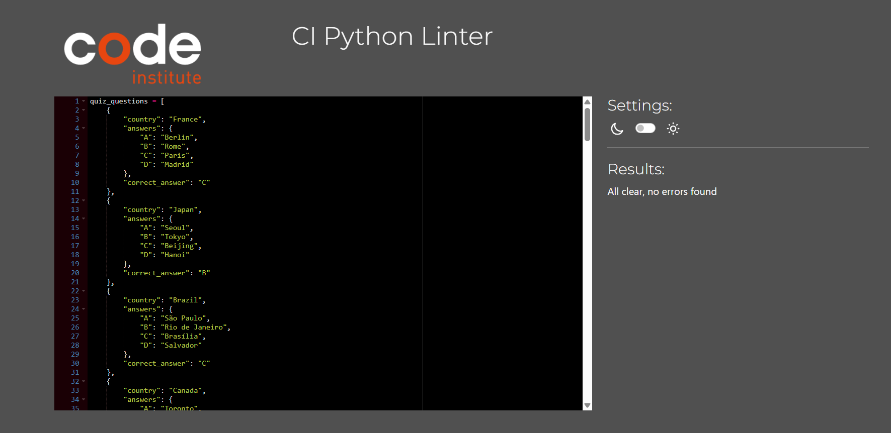 | 
|  | [run.py](https://github.com/marijavelickovska/world_capitals_challenge/blob/main/run.py) | [PEP8 CI Link](https://pep8ci.herokuapp.com/https://raw.githubusercontent.com/marijavelickovska/world_capitals_challenge/main/run.py) | 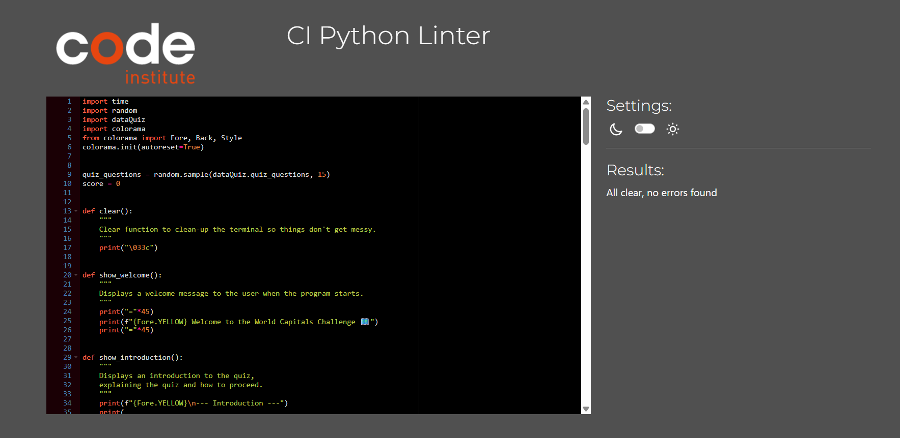 | 

## Responsiveness

I've tested my deployed project to check for responsiveness issues.
I attempted to test the responsiveness of the deployed page using the Inspect tool in the browser, but the page did not load properly – only a black background appeared. Therefore, I tested the responsiveness directly on real devices: a laptop, tablet, and mobile phone.

| Mobile | Tablet | Desktop | Notes |
| --- | --- | --- | --- |
| 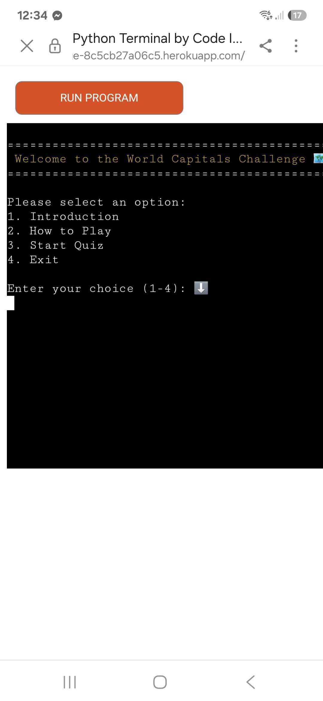 | 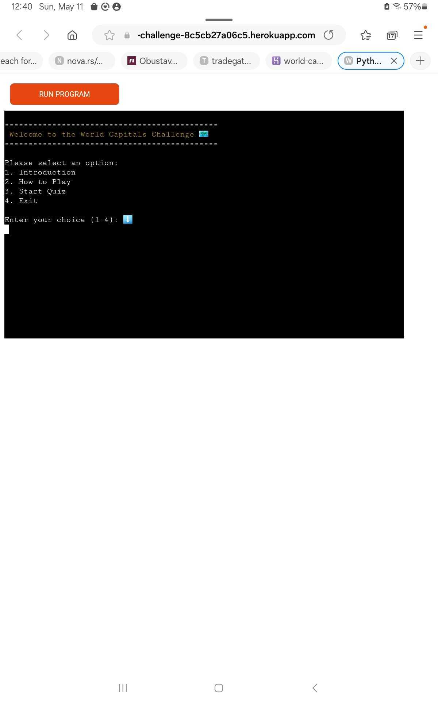 | 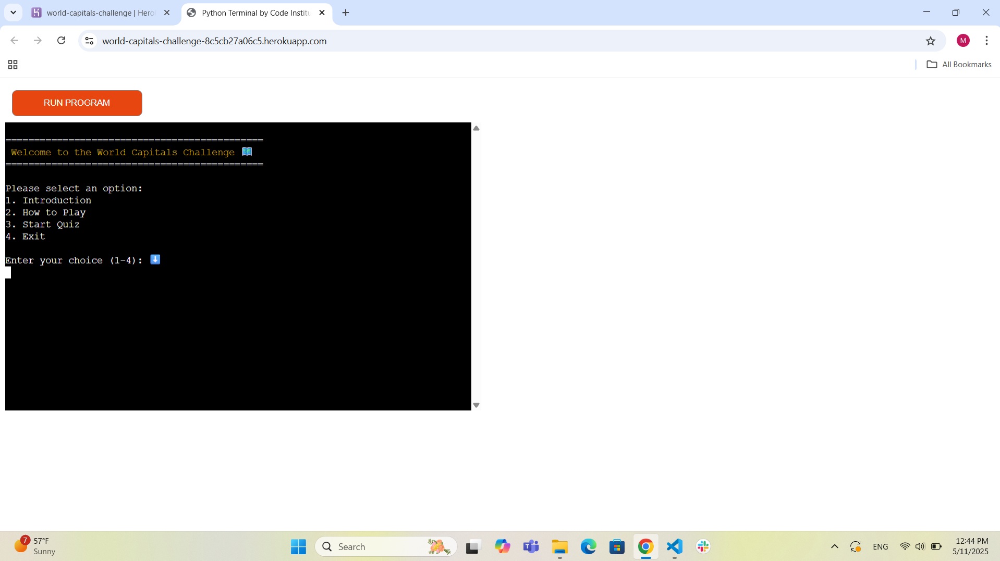 | Mobile issues: `overflow-x`, doesn't work on iPhones, but does work on Android with some limitations |

## Browser Compatibility

I've tested my deployed project on multiple browsers to check for compatibility issues.

| Chrome | Firefox | Edge | Notes |
| --- | --- | --- | --- |
|  | 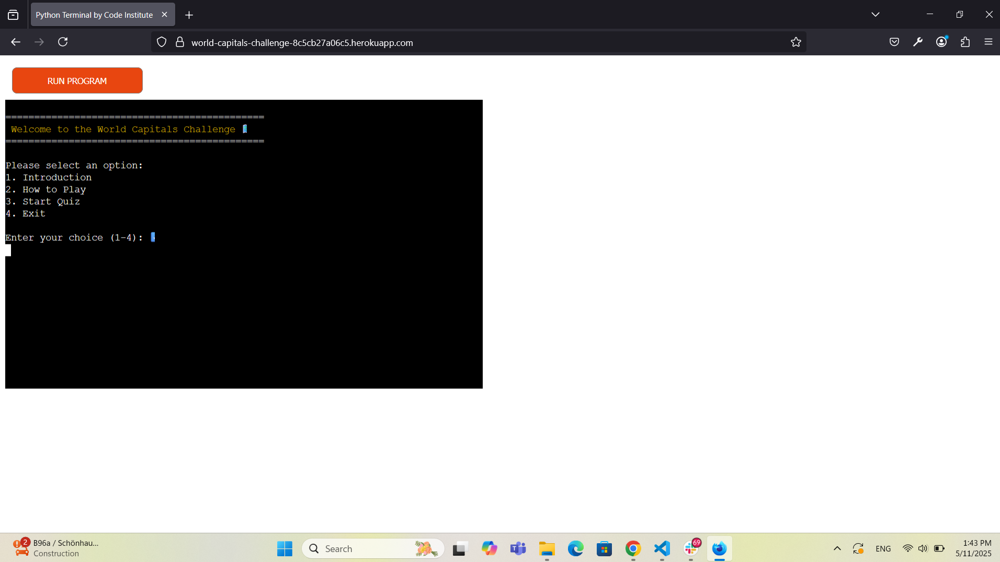 | 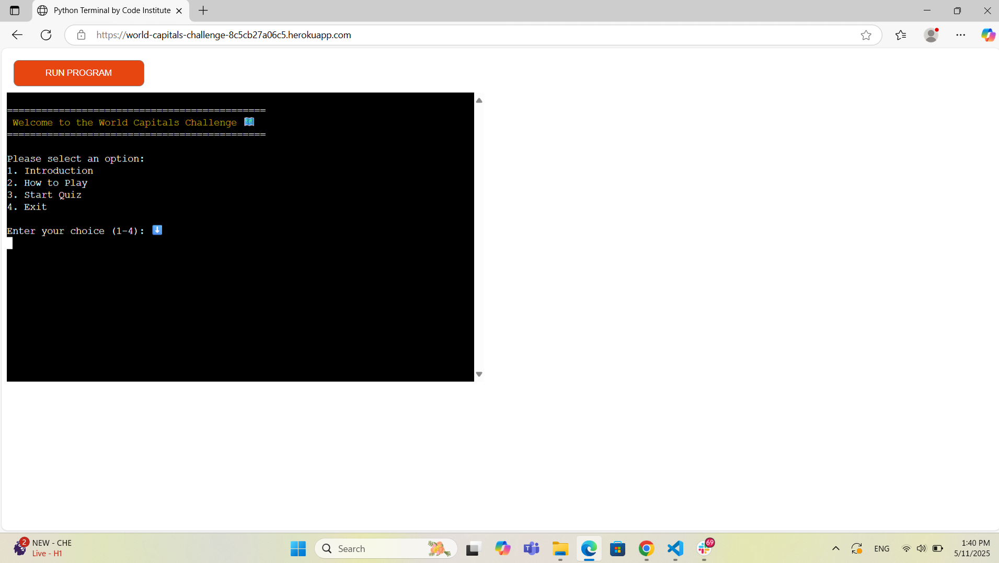 | Chrome and Edge: works as expected. Firefox: emojis get cut-off. |

## Lighthouse Audit

I've tested my deployed project using the Lighthouse Audit tool to check for any major issues. Some warnings are outside of my control, and mobile results tend to be lower than desktop.

| Mobile | Desktop |
| --- | --- |
|  |  |

## Defensive Programming

Defensive programming was manually tested with the below user acceptance testing:

| Feature | Expectation | Test | Result | Screenshot |
| --- | --- | --- | --- | --- |
| Main menu | Feature is expected to display a welcome message with a main menu offering 4 options and an input for user selection.  | Check if the main menu and input field are displayed correctly. | Works as expected – the welcome message, menu options, and input appear properly. | 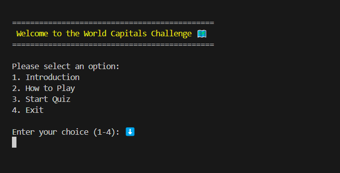 |
| Input 1/4 | Feature is expected to allow user to enter a number from 1 to 4 to select an option from main menu, and show an error for invalid input. | Enter valid (1–4) and invalid (other number, letters, symbols, empty input) values. | Works as expected – valid input proceeds correctly, invalid input shows error and re-prompts. | 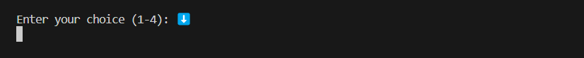 |
| Introduction | Feature is expected to display a short quiz introduction and a yes/no input to start the quiz or return to main menu.  | Check if the introduction text and yes/no input appear after selecting the quiz option. | Works as expected – introduction and input are shown. | 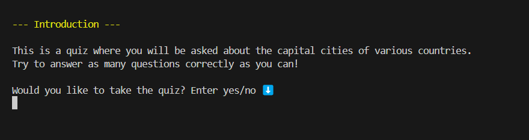 | 
| How to play | Feature is expected to display quiz instructions and provide a yes/no input to start the quiz or return to main menu.  | Select the "How to play" option and check if instructions and input appear correctly. | Works as expected – instructions and yes/no input are shown. | 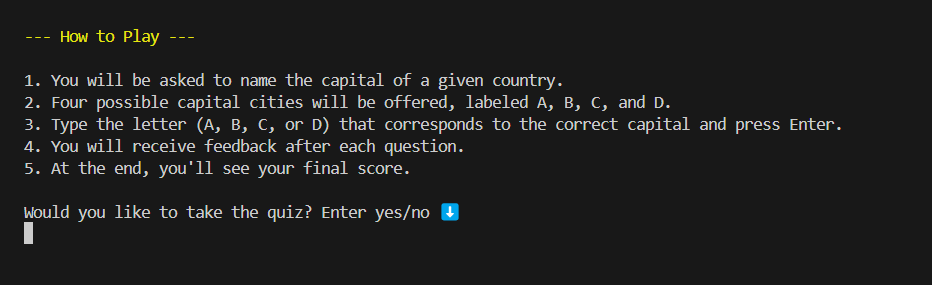 |
| Input yes/no | Feature is expected to accept only "yes" or "no" and reject any other input with an error message and re-prompt. | Enter valid and invalid inputs and check if validation works. | Works as expected – only "yes" or "no" are accepted; others show error and re-prompt. | 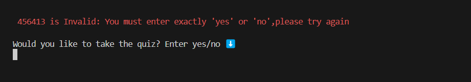 |
| Start quiz | Feature is expected to show a start message, display a random question with 4 options, and provide an input for answers. | Start the quiz and verify that a random question and options appear with input for the answer. | Works as expected – question, answers, and input are displayed correctly. | 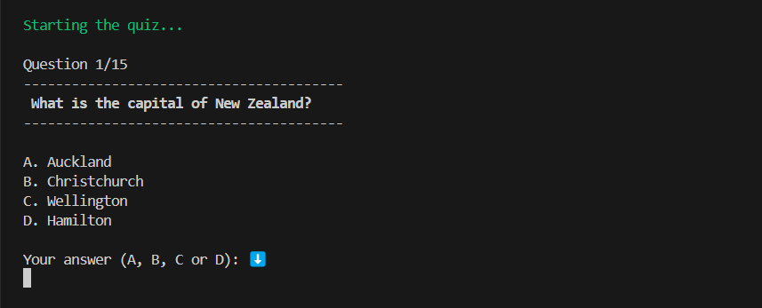 |
| Input A, B, C, D  | Feature is expected to accept only A, B, C, or D as valid input, and show an error for any other input with re-prompt. | Enter valid (A–D) and invalid (other letters, numbers, symbols, empty) inputs. | Works as expected – valid input proceeds, invalid input shows error and re-prompts. |  |
| Quiz progress | Feature is expected to show the current question number out of 15 and increment it as the quiz progresses. | Check that the progress (e.g. "Question 4/15") updates with each new question. | Works as expected – progress increases correctly with each question. |  |
| Correct answer message  | Feature is expected to display a confirmation message for a correct answer and confirm that the selected city is the capital. | Answer correctly and verify that the correct answer message is shown. | Works as expected – confirmation and capital city validation are displayed correctly. |  |
| Incorrect answer message  | Feature is expected to display the user's answer and show the correct one with a note that the answer was incorrect. | Answer incorrectly and check if the incorrect answer message shows the user's answer and correct answer. | Works as expected – the wrong answer message is shown along with the correct answer. | 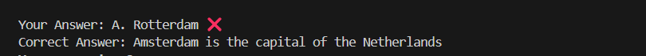 |
| Score | Feature is expected to display and update the score with each correct answer throughout the quiz. | Track score throughout the quiz to ensure it increases only on correct answers. | Works as expected – score is accurate and updates correctly. |  |
| End quiz | Feature is expected to show a completion message, display the final score, and offer a yes/no input to restart or exit. | Finish the quiz and check if final message, score, and input appear. | Works as expected – final results and replay option are shown. | 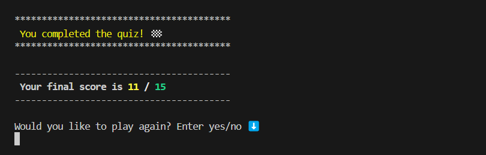 |
| Exit  | Feature is expected to display a goodbye message when the user chooses to exit. | Choose the exit option and verify that a goodbye message appears. | Works as expected – exit message is displayed correctly. | 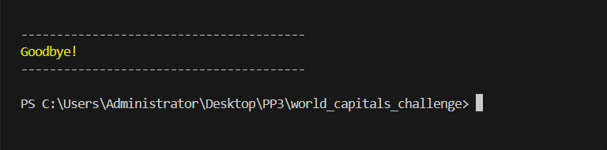 |

## User Story Testing

| Target | Expectation | Outcome | Screenshot |
| --- | --- | --- | --- |
| As a user | I want to start the quiz with a single click | so that I can begin answering questions immediately. |  |
| As a user | I want to see one question at a time | so that I can focus better on each answer. |  |
| As a user | I want to answer with just the first letter of a city's name | so that I can respond more quickly without typing the full name. |  |
| As a user | I want to get instant feedback after each answer | so that I can learn from my mistakes. |  |
| As a user | I want to see my final score at the end of the quiz | so that I can know how well I did. |  |
| As a parent | I want the quiz to be appropriate for all ages | so that I can use it with children or students. |  |

## Bugs

### Fixed Bugs

I've used [GitHub Issues](https://www.github.com/marijavelickovska/world_capitals_challenge/issues) to track and manage bugs and issues during the development stages of my project.

All previously closed/fixed bugs can be tracked [here](https://www.github.com/marijavelickovska/world_capitals_challenge/issues?q=is%3Aissue+is%3Aclosed+label%3Abug).

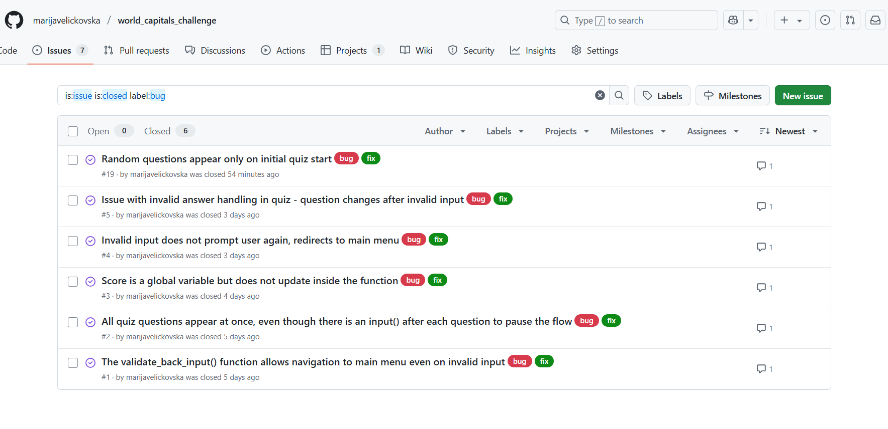

### Unfixed Bugs

Any remaining open issues can be tracked [here](https://www.github.com/marijavelickovska/world_capitals_challenge/issues).
These are not bugs, but issues labeled "won't have", representing features that are not part of the current quiz and are only listed as possible future ideas.

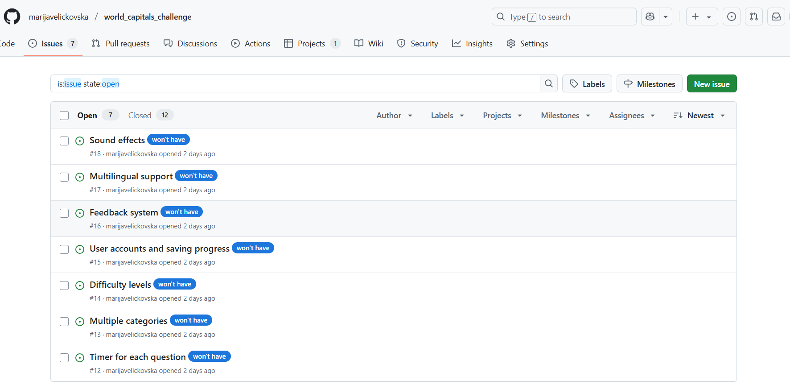

### Known Issues

| Issue | Screenshot |
| --- | --- |
| The `colorama` terminal colors are fainter on Heroku when compared to the IDE locally. | 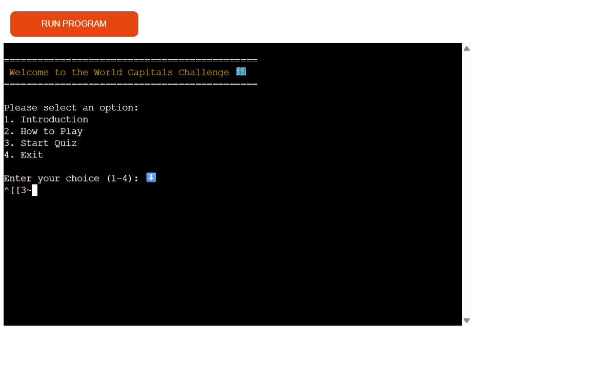 |
| Emojis are cut-off when viewing the application from Firefox. | 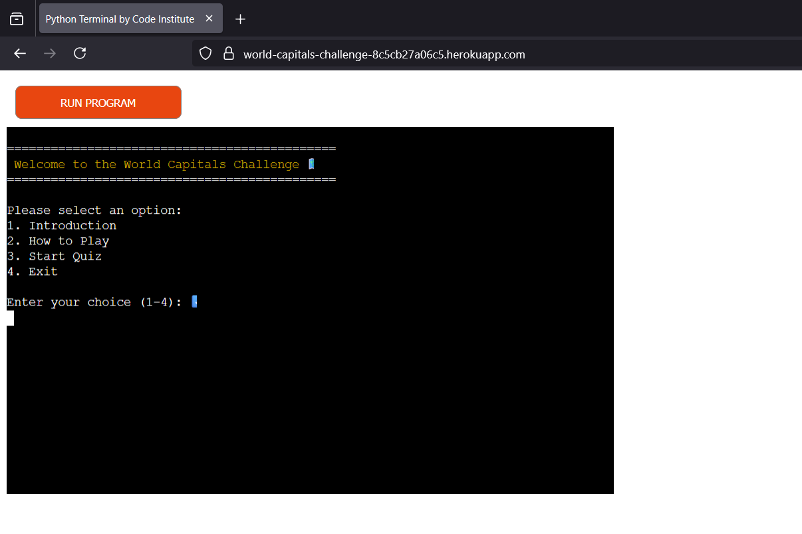 |
| If a user types `CTRL`+`C` in the terminal on the live site, they can manually stop the application and receive and error. | 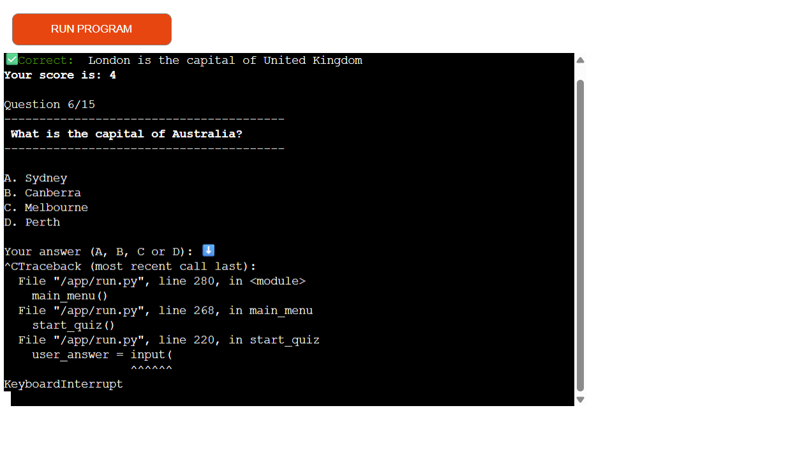 |

> [!IMPORTANT]
> There are no remaining bugs that I am aware of, though, even after thorough testing, I cannot rule out the possibility.

