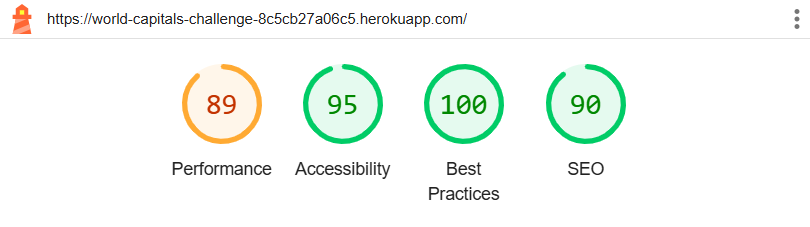
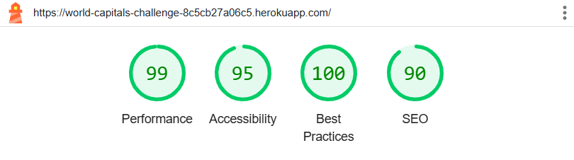
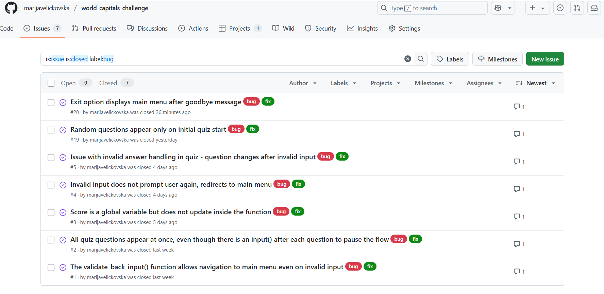
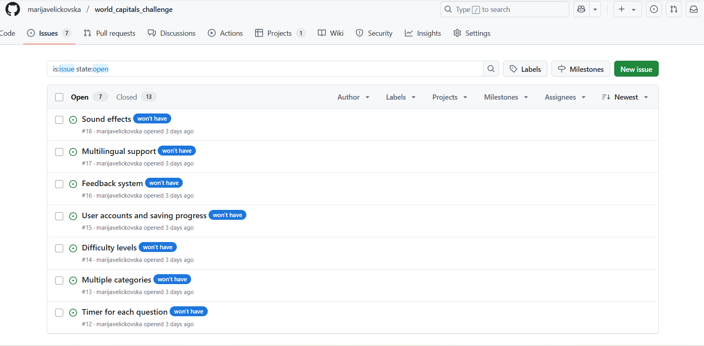

# Testing

> [!NOTE]
> Return back to the [README.md](README.md) file.

## Code Validation

### Python

I have used the recommended [PEP8 CI Python Linter](https://pep8ci.herokuapp.com) to validate all of my Python files.

| Directory | File | URL | Screenshot | Notes |
| --- | --- | --- | --- | --- |
|  | [dataQuiz.py](https://github.com/marijavelickovska/world_capitals_challenge/blob/main/dataQuiz.py) | [PEP8 CI Link](https://pep8ci.herokuapp.com/https://raw.githubusercontent.com/marijavelickovska/world_capitals_challenge/main/dataQuiz.py) |  | Notes (if applicable) |
|  | [run.py](https://github.com/marijavelickovska/world_capitals_challenge/blob/main/run.py) | [PEP8 CI Link](https://pep8ci.herokuapp.com/https://raw.githubusercontent.com/marijavelickovska/world_capitals_challenge/main/run.py) |  | Notes (if applicable) |

## Responsiveness

I've tested my deployed project to check for responsiveness issues.
I attempted to test the responsiveness of the deployed page using the Inspect tool in the browser, but the page did not load properly – only a black background appeared. Therefore, I tested the responsiveness directly on real devices: a laptop, tablet, and mobile phone.

| Mobile | Tablet | Desktop | Notes |
| --- | --- | --- | --- |
|  |  |  | Mobile issues: `overflow-x`, doesn't work on iPhones, but does work on Android with some limitations |

## Browser Compatibility

🛑 NOTE 🛑

You are NOT required to showcase "Browser Compatibility" testing for PP3. The Python terminal was provided to you by Code Institute, and there are known issues with it not being compatible for all browsers. Compatibility testing for PP3 is only an added bonus, so if you don't want to include it, feel free to remove this entire **Browser Compatibility** section.

If you are performing compatibility tests, here is a known issue that you can document for PP3 specifically:

- Firefox: emojis get cut-off
- Safari: doesn't work well for any Apple devices except MacBooks

🛑 --- END --- 🛑

⚠️ INSTRUCTIONS ⚠️

Use this space to discuss testing the live/deployed site on various browsers. Consider testing at least 3 different browsers, if available on your system. You DO NOT need to use all of the browsers below, just pick any 3 (minimum).

Recommended browsers to consider:
- [Chrome](https://www.google.com/chrome)
- [Firefox (Developer Edition)](https://www.mozilla.org/firefox/developer)
- [Edge](https://www.microsoft.com/edge)
- [Safari](https://support.apple.com/downloads/safari)
- [Brave](https://brave.com/download)
- [Opera](https://www.opera.com/download)

**IMPORTANT**: You must provide screenshots of the browsers you've tested, to "prove" that you've actually tested them.

Please note, there are services out there that can test multiple browser compatibilities at the same time. Some of these are paid services, but some are free. If you use these, you must provide a link to the source used for attribution, and multiple screenshots of the results.

⚠️ --- END --- ⚠️

I've tested my deployed project on multiple browsers to check for compatibility issues.

| Chrome | Firefox | Safari | Notes |
| --- | --- | --- | --- |
|  |  |  | Chrome: work as expected. Firefox: emojis get cut-off. Safari: some limitations. |

## Lighthouse Audit

🛑 NOTE 🛑

You are NOT required to showcase "Lighthouse Audit" testing for PP3. The Python terminal was provided to you by Code Institute, and there are known issues with it not having decent scores, especially on mobile. Lighthouse testing for PP3 is only an added bonus, so if you don't want to include it, feel free to remove this entire **Lighthouse Audit** section.

If you are performing Lighthouse tests, here is a known issue that you can document for PP3 specifically:

- Mobile: external render-blocking resources & third-party cookies lower performance and best practices scores.

🛑 --- END --- 🛑

⚠️ INSTRUCTIONS ⚠️

Use this space to discuss testing the live/deployed site's Lighthouse Audit reports. Avoid testing the local version (Gitpod/VSCode/etc.), as this can have knock-on effects for performance. If you don't have "Lighthouse" in your Developer Tools, it can be added as an [extension](https://chrome.google.com/webstore/detail/lighthouse/blipmdconlkpinefehnmjammfjpmpbjk).

Unless your project is a single-page application (SPA), you should test Lighthouse Audit results for all of your pages, for both *mobile* and *desktop*.

**IMPORTANT**: You must provide screenshots of the results, to "prove" that you've actually tested them.

⚠️ --- END --- ⚠️

I've tested my deployed project using the Lighthouse Audit tool to check for any major issues. Some warnings are outside of my control, and mobile results tend to be lower than desktop.

| Mobile | Desktop |
| --- | --- |
|  |  |

## Defensive Programming

⚠️ INSTRUCTIONS ⚠️

Defensive programming (defensive design) is extremely important! When building projects that accept user inputs or forms, you should always test the level of security for each form field. Examples of this could include (but not limited to):

All Projects:

- Users cannot submit an empty form (add the `required` attribute)
- Users must enter valid field types (ensure the correct input `type=""` is used)
- Users cannot brute-force a URL to navigate to a restricted pages

Python Projects:

- Users cannot perform CRUD functionality if not authenticated (if login functionality exists)
- User-A should not be able to manipulate data belonging to User-B, or vice versa
- Non-Authenticated users should not be able to access pages that require authentication
- Standard users should not be able to access pages intended for superusers/admins

You'll want to test all functionality on your application, whether it's a standard form, or CRUD functionality, for data manipulation on a database. Try to access various pages on your site as different user types (User-A, User-B, guest user, admin, superuser). You should include any manual tests performed, and the expected results/outcome.

Testing should be replicable (can someone else replicate the same outcome?). Ideally, tests cases should focus on each individual section of every page on the website. Each test case should be specific, objective, and step-wise replicable.

Instead of adding a general overview saying that everything works fine, consider documenting tests on each element of the page (eg. button clicks, input box validation, navigation links, etc.) by testing them in their "happy flow", their "bad/exception flow", mentioning the expected and observed results, and drawing a parallel between them where applicable.

Consider using the following format for manual test cases:

- Expected Outcome / Test Performed / Result Received / Fixes Implemented

- **Expected**: "Feature is expected to do X when the user does Y."
- **Testing**: "Tested the feature by doing Y."
- (either) **Result**: "The feature behaved as expected, and it did Y."
- (or) **Result**: "The feature did not respond to A, B, or C."
- **Fix**: "I did Z to the code because something was missing."

Use the table below as a basic start, and expand on it using the logic above.

⚠️ --- END --- ⚠️

Defensive programming was manually tested with the below user acceptance testing:

| Feature | Expectation | Test | Result | Screenshot |
| --- | --- | --- | --- | --- |
| Sales Input | Feature is expected to allow users to input the number of each sandwich type sold during the day. | Entered sales data for various sandwich types using a mock dataset. | Sales data was successfully recorded and saved. |  |
| | Feature is expected to minimize typing for quick input. | Used pre-defined options for sandwich types to streamline data entry. | Input process was fast and required minimal typing. |  |
| Sales Breakdown | Feature is expected to show a breakdown of total sandwich sales by type. | Reviewed the breakdown output after entering sales data. | Breakdown displayed correctly, with sales totals for each sandwich type. |  |
| | Feature is expected to categorize sandwiches by type (e.g., vegetarian, meat, cheese). | Checked the categorization of sandwiches in the breakdown. | Sandwiches were correctly categorized by dietary type. |  |
| Total Sales | Feature is expected to calculate the total sandwiches sold for the day. | Verified the total sales calculation with a known dataset. | Total sales calculation matched the expected result. |  |
| Trends | Feature is expected to display a trend of sandwich sales over time (e.g., week, month). | Input sales data for a week and reviewed the trend output. | Trends were displayed accurately for the selected timeframe. |  |
| Suggestions | Feature is expected to suggest estimated sales for the next day based on past sales data. | Input past sales data and reviewed next-day suggestions. | Suggestions were reasonable and based on past sales trends. |  |
| Usability | Feature is expected to be intuitive and easy to use. | Used the app without referring to documentation or prior knowledge. | App was intuitive and user-friendly for sales tracking. |  |

## User Story Testing

⚠️ INSTRUCTIONS ⚠️

Testing User Stories is actually quite simple, once you've already got the stories defined on your README.

Most of your project's **Features** should already align with the **User Stories**, so this should be as simple as creating a table with the User Story, matching with the re-used screenshot from the respective Feature.

⚠️ --- END --- ⚠️

| Target | Expectation | Outcome | Screenshot |
| --- | --- | --- | --- |
| As a user | I would like to input the number of each sandwich type sold during the day | so that I can track daily sales accurately. |  |
| As a user | I would like to view a breakdown of total sandwich sales by type | so that I can easily see which sandwiches are the most and least popular. |  |
| As a user | I would like the application to calculate the total sandwiches sold for the day | so that I don’t have to do manual sums. |  |
| As a user | I would like to see a trend of sandwich sales over time (e.g., week, month) | so that I can identify which sandwiches are consistently popular. |  |
| As a user | I would like the application to suggest an estimated number of each sandwich type to make for the next day, based on past sales data | so that I can minimize waste and shortages. |  |
| As a user | I would like the app to categorize sandwiches by type (e.g., vegetarian, meat, cheese) | so that I can track popularity within different dietary categories. |  |
| As a user | I would like to input sales quickly with minimal typing | so that I can focus on running the shop instead of logging data. |  |
| As a user | I would like the app to be intuitive and easy to use | so that I can start tracking sales without needing extensive training. |  |

## Bugs

⚠️ INSTRUCTIONS ⚠️

Nobody likes bugs,... except the assessors! Projects seem more suspicious if a student doesn't properly track their bugs. If you're about to submit your project without any bugs listed below, you should ask yourself why you're doing this course in the first place, if you're able to build this entire application without running into any bugs. The best thing you can do for any project is to document your bugs! Not only does it show the true stages of development, but think of it as breadcrumbs for yourself in the future, should you encounter the same/similar bug again, it acts as a gentle reminder on what you did to fix the bug.

If/when you encounter bugs during the development stages of your project, you should document them here, ideally with a screenshot explaining what the issue was, and what you did to fix the bug.

Alternatively, an improved way to manage bugs is to use the built-in **[Issues](https://www.github.com/marijavelickovska/world_capitals_challenge/issues)** tracker on your GitHub repository. This can be found at the top of your repository, the tab called "Issues".

If using the Issues tracker for bug management, you can simplify the documentation process for testing. Issues allow you to directly paste screenshots into the issue page without having to first save the screenshot locally. You can add labels to your issues (e.g. `bug`), assign yourself as the owner, and add comments/updates as you progress with fixing the issue(s). Once you've solved the issue/bug, you should then "Close" it.

When showcasing your bug tracking for assessment, you can use the following examples below.

⚠️ --- END --- ⚠️

### Fixed Bugs

I've used [GitHub Issues](https://www.github.com/marijavelickovska/world_capitals_challenge/issues) to track and manage bugs and issues during the development stages of my project.

All previously closed/fixed bugs can be tracked [here](https://www.github.com/marijavelickovska/world_capitals_challenge/issues?q=is%3Aissue+is%3Aclosed+label%3Abug).

### Unfixed Bugs

⚠️ INSTRUCTIONS ⚠️

You will need to mention any unfixed bugs and why they are not fixed upon submission of your project. This section should include shortcomings of the frameworks or technologies used. Although time can be a big variable to consider, paucity of time and difficulty understanding implementation is not a valid reason to leave bugs unfixed. Where possible, you must fix all outstanding bugs, unless outside of your control.

If you've identified any unfixed bugs, no matter how small, be sure to list them here! It's better to be honest and list them, because if it's not documented and an assessor finds the issue, they need to know whether or not you're aware of them as well, and why you've not corrected/fixed them.

⚠️ --- END --- ⚠️

Any remaining open issues can be tracked [here](https://www.github.com/marijavelickovska/world_capitals_challenge/issues).

### Known Issues

| Issue | Screenshot |
| --- | --- |
| When using a helper `clear()` function, any text above the height of the terminal (24 lines) does not clear, and remains when scrolling up. |  |
| The `colorama` terminal colors are fainter on Heroku when compared to the IDE locally. |  |
| Emojis are cut-off when viewing the application from Firefox. |  |
| The Python terminal doesn't work well with Safari, and sometimes uses cannot type in the application. |  |
| If a user types `CTRL`+`C` in the terminal on the live site, they can manually stop the application and receive and error. |  |

> [!IMPORTANT]
> There are no remaining bugs that I am aware of, though, even after thorough testing, I cannot rule out the possibility.

