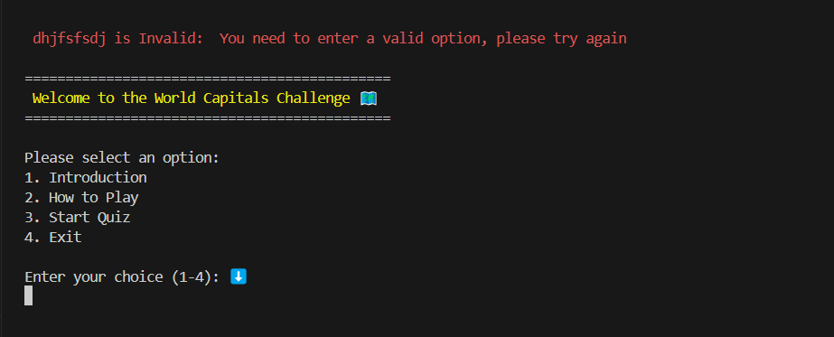

# Testing

> [!NOTE]
> Return back to the [README.md](README.md) file.

## Code Validation

### Python

I have used the recommended [PEP8 CI Python Linter](https://pep8ci.herokuapp.com) to validate all of my Python files.

| Directory | File | URL | Screenshot | Notes |
| --- | --- | --- | --- | --- |
|  | [dataQuiz.py](https://github.com/marijavelickovska/world_capitals_challenge/blob/main/dataQuiz.py) | [PEP8 CI Link](https://pep8ci.herokuapp.com/https://raw.githubusercontent.com/marijavelickovska/world_capitals_challenge/main/dataQuiz.py) |  | Notes (if applicable) |
|  | [run.py](https://github.com/marijavelickovska/world_capitals_challenge/blob/main/run.py) | [PEP8 CI Link](https://pep8ci.herokuapp.com/https://raw.githubusercontent.com/marijavelickovska/world_capitals_challenge/main/run.py) |  | Notes (if applicable) |

## Responsiveness

I've tested my deployed project to check for responsiveness issues.
I attempted to test the responsiveness of the deployed page using the Inspect tool in the browser, but the page did not load properly – only a black background appeared. Therefore, I tested the responsiveness directly on real devices: a laptop, tablet, and mobile phone.

| Mobile | Tablet | Desktop | Notes |
| --- | --- | --- | --- |
|  |  |  | Mobile issues: `overflow-x`, doesn't work on iPhones, but does work on Android with some limitations |

## Browser Compatibility

I've tested my deployed project on multiple browsers to check for compatibility issues.

| Chrome | Firefox | Edge | Notes |
| --- | --- | --- | --- |
|  |  |  | Chrome: work as expected. Firefox: emojis get cut-off. Safari: some limitations. |

## Lighthouse Audit

I've tested my deployed project using the Lighthouse Audit tool to check for any major issues. Some warnings are outside of my control, and mobile results tend to be lower than desktop.

| Mobile | Desktop |
| --- | --- |
|  |  |

## Defensive Programming

Defensive programming was manually tested with the below user acceptance testing:

| Feature | Expectation | Test | Result | Screenshot |
| --- | --- | --- | --- | --- |
| Main menu | Feature is expected to display a welcome message with a main menu offering 4 options and an input for user selection.  | Check if the main menu and input field are displayed correctly. | Works as expected – the welcome message, menu options, and input appear properly. |  |
| Input 1/4 | Feature is expected to allow user to enter a number from 1 to 4 to select an option from main menu, and show an error for invalid input. | Enter valid (1–4) and invalid (other number, letters, symbols, empty input) values. | Works as expected – valid input proceeds correctly, invalid input shows error and re-prompts. |  |
| Introduction | Feature is expected to display a short quiz introduction and a yes/no input to start the quiz or return to main menu.  | Check if the introduction text and yes/no input appear after selecting the quiz option. | Works as expected – introduction and input are shown. |  | 
| How to play | Feature is expected to display quiz instructions and provide a yes/no input to start the quiz or return to main menu.  | Select the "How to play" option and check if instructions and input appear correctly. | Works as expected – instructions and yes/no input are shown. |  |
| Input yes/no | Feature is expected to accept only "yes" or "no" and reject any other input with an error message and re-prompt. | Enter valid and invalid inputs and check if validation works. | Works as expected – only "yes" or "no" are accepted; others show error and re-prompt. |  |
| Start quiz | Feature is expected to show a start message, display a random question with 4 options, and provide an input for answers. | Start the quiz and verify that a random question and options appear with input for the answer. | Works as expected – question, answers, and input are displayed correctly. |  |
| Input A, B, C, D  | Feature is expected to accept only A, B, C, or D as valid input, and show an error for any other input with re-prompt. | Enter valid (A–D) and invalid (other letters, numbers, symbols, empty) inputs. | Works as expected – valid input proceeds, invalid input shows error and re-prompts. |  |
| Quiz progress | Feature is expected to show the current question number out of 15 and increment it as the quiz progresses. | Check that the progress (e.g. "Question 4/15") updates with each new question. | Works as expected – progress increases correctly with each question. |  |
| Correct answer message  | Feature is expected to display a confirmation message for a correct answer and confirm that the selected city is the capital. | Answer correctly and verify that the correct answer message is shown. | Works as expected – confirmation and capital city validation are displayed correctly. |  |
| Incorrect answer message  | Feature is expected to display the user's answer and show the correct one with a note that the answer was incorrect. | Answer incorrectly and check if the incorrect answer message shows the user's answer and correct answer. | Works as expected – the wrong answer message is shown along with the correct answer. |  |
| Score | Feature is expected to display and update the score with each correct answer throughout the quiz. | Track score throughout the quiz to ensure it increases only on correct answers. | Works as expected – score is accurate and updates correctly. |  |
| End quiz | Feature is expected to show a completion message, display the final score, and offer a yes/no input to restart or exit. | Finish the quiz and check if final message, score, and input appear. | Works as expected – final results and replay option are shown. |  |
| Exit  | Feature is expected to display a goodbye message when the user chooses to exit. | Choose the exit option and verify that a goodbye message appears. | Works as expected – exit message is displayed correctly. |  |

## User Story Testing

⚠️ INSTRUCTIONS ⚠️

Testing User Stories is actually quite simple, once you've already got the stories defined on your README.

Most of your project's **Features** should already align with the **User Stories**, so this should be as simple as creating a table with the User Story, matching with the re-used screenshot from the respective Feature.

⚠️ --- END --- ⚠️

| Target | Expectation | Outcome | Screenshot |
| --- | --- | --- | --- |
| As a user | I would like to input the number of each sandwich type sold during the day | so that I can track daily sales accurately. |  |
| As a user | I would like to view a breakdown of total sandwich sales by type | so that I can easily see which sandwiches are the most and least popular. |  |
| As a user | I would like the application to calculate the total sandwiches sold for the day | so that I don’t have to do manual sums. |  |
| As a user | I would like to see a trend of sandwich sales over time (e.g., week, month) | so that I can identify which sandwiches are consistently popular. |  |
| As a user | I would like the application to suggest an estimated number of each sandwich type to make for the next day, based on past sales data | so that I can minimize waste and shortages. |  |
| As a user | I would like the app to categorize sandwiches by type (e.g., vegetarian, meat, cheese) | so that I can track popularity within different dietary categories. |  |
| As a user | I would like to input sales quickly with minimal typing | so that I can focus on running the shop instead of logging data. |  |
| As a user | I would like the app to be intuitive and easy to use | so that I can start tracking sales without needing extensive training. |  |

## Bugs

⚠️ INSTRUCTIONS ⚠️

Nobody likes bugs,... except the assessors! Projects seem more suspicious if a student doesn't properly track their bugs. If you're about to submit your project without any bugs listed below, you should ask yourself why you're doing this course in the first place, if you're able to build this entire application without running into any bugs. The best thing you can do for any project is to document your bugs! Not only does it show the true stages of development, but think of it as breadcrumbs for yourself in the future, should you encounter the same/similar bug again, it acts as a gentle reminder on what you did to fix the bug.

If/when you encounter bugs during the development stages of your project, you should document them here, ideally with a screenshot explaining what the issue was, and what you did to fix the bug.

Alternatively, an improved way to manage bugs is to use the built-in **[Issues](https://www.github.com/marijavelickovska/world_capitals_challenge/issues)** tracker on your GitHub repository. This can be found at the top of your repository, the tab called "Issues".

If using the Issues tracker for bug management, you can simplify the documentation process for testing. Issues allow you to directly paste screenshots into the issue page without having to first save the screenshot locally. You can add labels to your issues (e.g. `bug`), assign yourself as the owner, and add comments/updates as you progress with fixing the issue(s). Once you've solved the issue/bug, you should then "Close" it.

When showcasing your bug tracking for assessment, you can use the following examples below.

⚠️ --- END --- ⚠️

### Fixed Bugs

I've used [GitHub Issues](https://www.github.com/marijavelickovska/world_capitals_challenge/issues) to track and manage bugs and issues during the development stages of my project.

All previously closed/fixed bugs can be tracked [here](https://www.github.com/marijavelickovska/world_capitals_challenge/issues?q=is%3Aissue+is%3Aclosed+label%3Abug).

### Unfixed Bugs

⚠️ INSTRUCTIONS ⚠️

You will need to mention any unfixed bugs and why they are not fixed upon submission of your project. This section should include shortcomings of the frameworks or technologies used. Although time can be a big variable to consider, paucity of time and difficulty understanding implementation is not a valid reason to leave bugs unfixed. Where possible, you must fix all outstanding bugs, unless outside of your control.

If you've identified any unfixed bugs, no matter how small, be sure to list them here! It's better to be honest and list them, because if it's not documented and an assessor finds the issue, they need to know whether or not you're aware of them as well, and why you've not corrected/fixed them.

⚠️ --- END --- ⚠️

Any remaining open issues can be tracked [here](https://www.github.com/marijavelickovska/world_capitals_challenge/issues).

### Known Issues

| Issue | Screenshot |
| --- | --- |
| When using a helper `clear()` function, any text above the height of the terminal (24 lines) does not clear, and remains when scrolling up. |  |
| The `colorama` terminal colors are fainter on Heroku when compared to the IDE locally. |  |
| Emojis are cut-off when viewing the application from Firefox. |  |
| The Python terminal doesn't work well with Safari, and sometimes uses cannot type in the application. |  |
| If a user types `CTRL`+`C` in the terminal on the live site, they can manually stop the application and receive and error. |  |

> [!IMPORTANT]
> There are no remaining bugs that I am aware of, though, even after thorough testing, I cannot rule out the possibility.

